> [!IMPORTANT]
> **Repository moved:** Reactive Resume now lives at **[`reactive-resume/reactive-resume`](https://github.com/reactive-resume/reactive-resume)** on GitHub.
> **Docker Hub stays at `amruthpillai/reactive-resume`.** GHCR builds now publish to `ghcr.io/reactive-resume/reactive-resume`.
> Verified image tags: `latest`, `v5`, `v5.3`, and `v5.3.0` (AMD64 and ARM64). The current version was rebuilt and production redeployed for this rename; no new GitHub release or version bump was made. See [migration details](https://github.com/reactive-resume/reactive-resume/issues/3503).
> GitHub Sponsors and Open Collective funding links remain unchanged.

<div align="center">
  <a href="https://rxresu.me">
    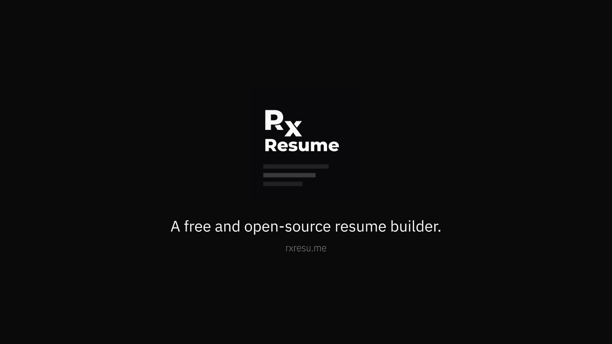
  </a>

  <h1>Reactive Resume</h1>

  <p>Reactive Resume is a free and open-source resume builder that makes it easy to create, update, and share your resume.</p>

  <p>
    <a href="https://rxresu.me"><strong>Get Started</strong></a>
    ·
    <a href="https://docs.rxresu.me"><strong>Learn More</strong></a>
  </p>

  <p>
    
    
    
    
    <a href="https://discord.gg/aSyA5ZSxpb"></a>
    <a href="https://crowdin.com/project/reactive-resume"></a>
    <a href="https://github.com/sponsors/AmruthPillai"></a>
    <a href="https://opencollective.com/reactive-resume/donate"></a>
  </p>

  <br />
  <a href="https://vercel.com/open-source-program">
    
  </a>
</div>

---

Pick a template, fill in your details, and export to PDF. Basic use needs no account. If you want more control, you can run the whole application on your own infrastructure.

You own your data. The codebase is open source under the MIT license, with no tracking, no ads, and no hidden costs.

## Features

**Resume Building**

- Live preview as you type
- Multiple export formats (PDF, JSON, DOCX)
- Drag-and-drop section ordering
- Custom sections for any content type
- Rich text editor

**Templates**

- 15 templates to choose from
- A4 and Letter page sizes
- Customizable colors, fonts, and spacing
- Structured Style Rules for section and text styling

**Privacy & Control**

- Self-host on your own infrastructure
- No tracking or analytics by default
- Full data export at any time
- Delete your data permanently with one click

**Extras**

- AI integration (OpenAI, Google Gemini, Anthropic Claude)
- Multi-language support
- Share resumes via unique links
- Import from JSON Resume format
- Dark mode
- Passkey and two-factor authentication

## Templates

<table>
  <tr>
    <td align="center">
      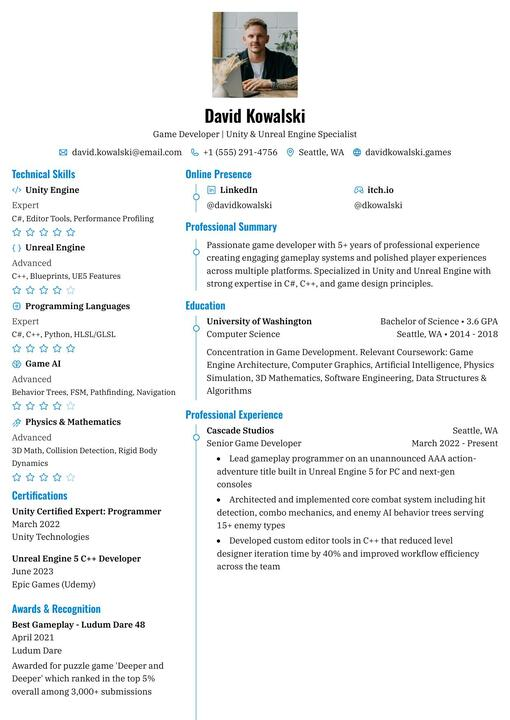
      <br /><sub><b>Azurill</b></sub>
    </td>
    <td align="center">
      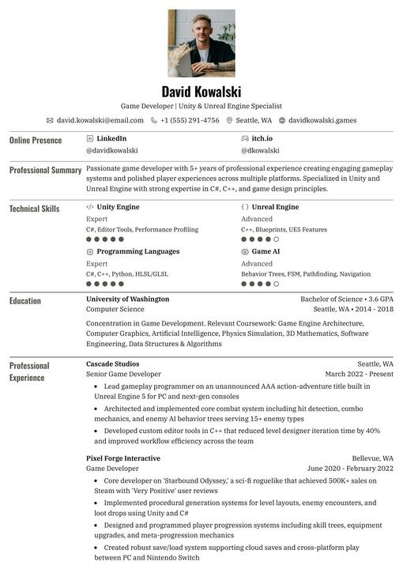
      <br /><sub><b>Bronzor</b></sub>
    </td>
    <td align="center">
      
      <br /><sub><b>Chikorita</b></sub>
    </td>
    <td align="center">
      
      <br /><sub><b>Ditto</b></sub>
    </td>
  </tr>
  <tr>
    <td align="center">
      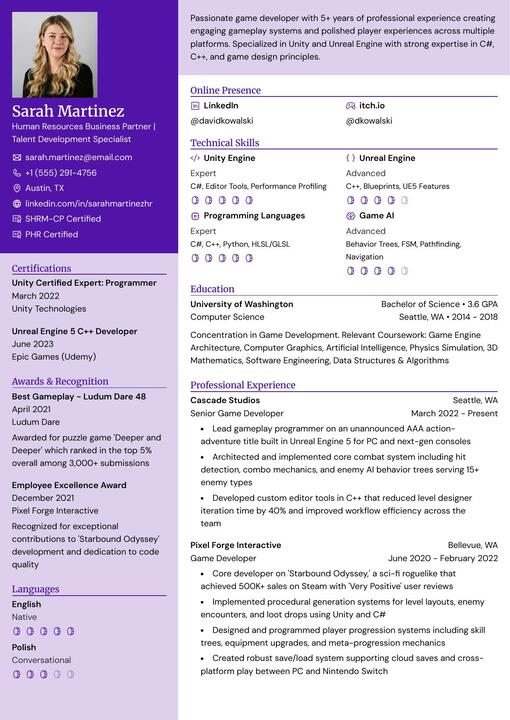
      <br /><sub><b>Gengar</b></sub>
    </td>
    <td align="center">
      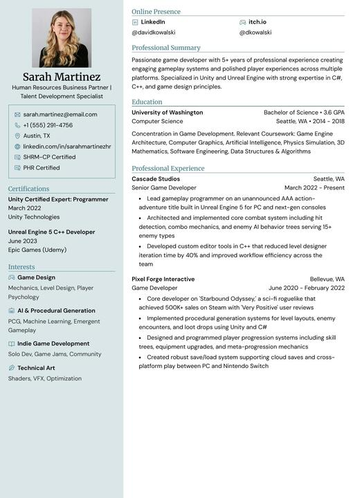
      <br /><sub><b>Glalie</b></sub>
    </td>
    <td align="center">
      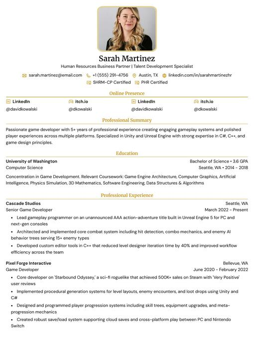
      <br /><sub><b>Kakuna</b></sub>
    </td>
    <td align="center">
      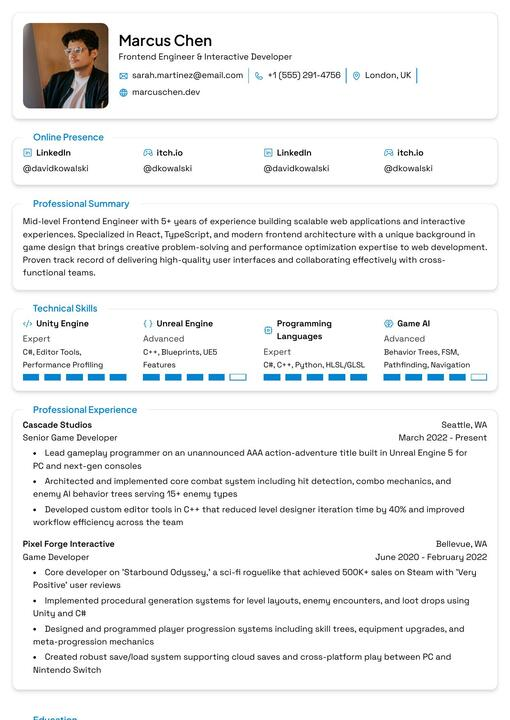
      <br /><sub><b>Lapras</b></sub>
    </td>
  </tr>
  <tr>
    <td align="center">
      
      <br /><sub><b>Leafish</b></sub>
    </td>
    <td align="center">
      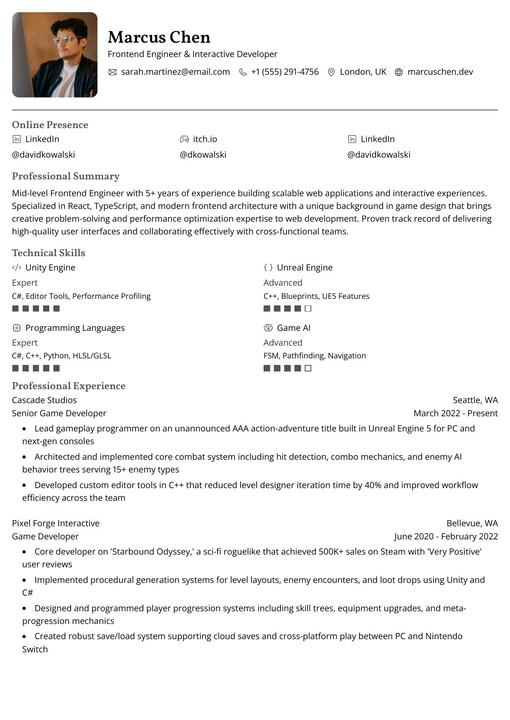
      <br /><sub><b>Onyx</b></sub>
    </td>
    <td align="center">
      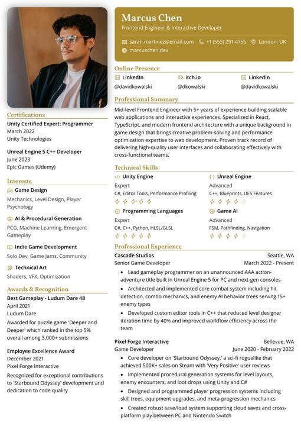
      <br /><sub><b>Pikachu</b></sub>
    </td>
    <td align="center">
      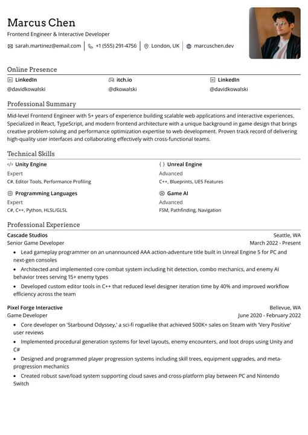
      <br /><sub><b>Rhyhorn</b></sub>
    </td>
  </tr>
  <tr>
    <td align="center">
      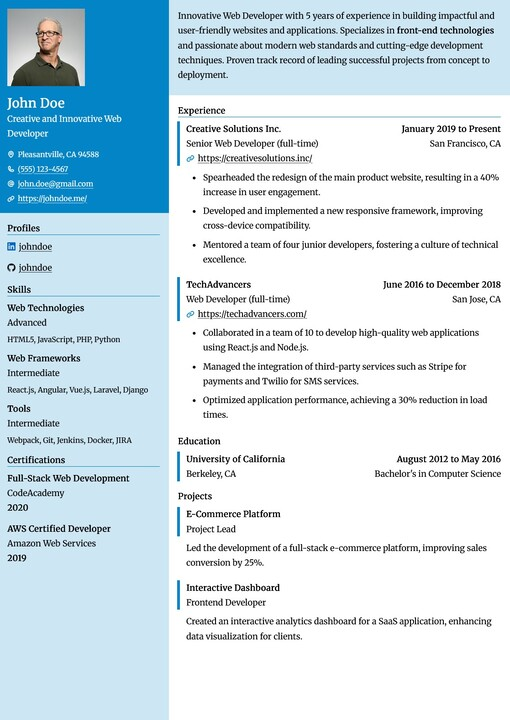
      <br /><sub><b>Ditgar</b></sub>
    </td>
    <td align="center">
      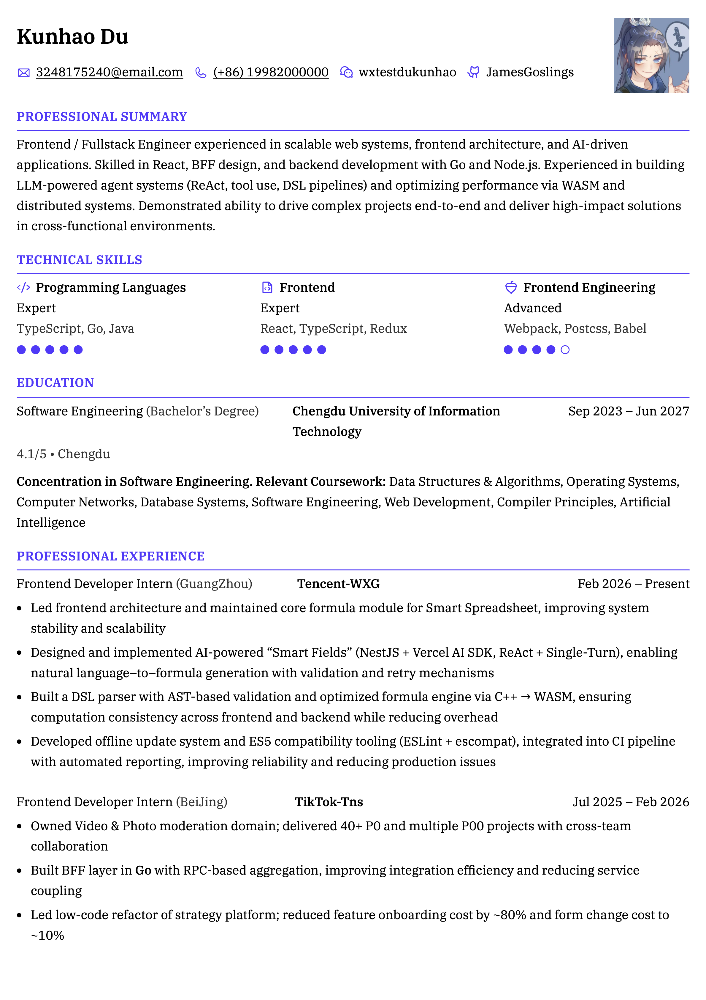
      <br /><sub><b>Meowth</b></sub>
    </td>
    <td align="center">
      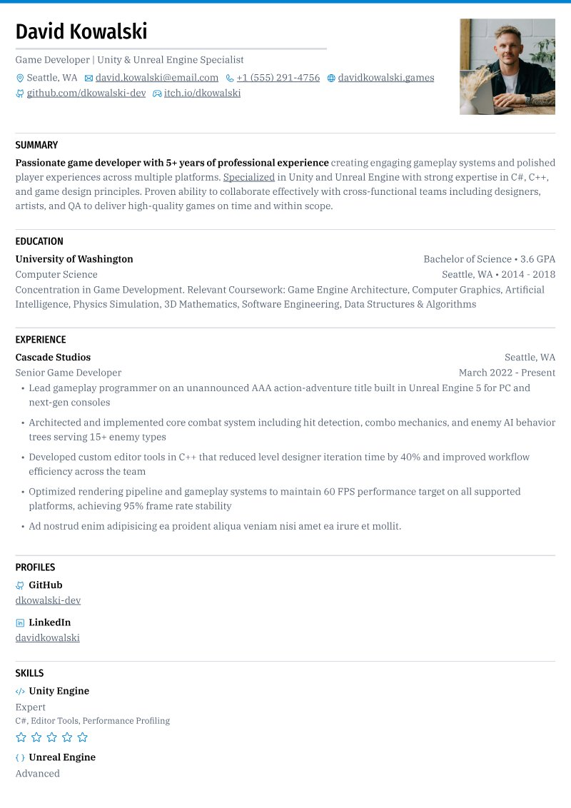
      <br /><sub><b>Scizor</b></sub>
    </td>
  </tr>
</table>

## Quick Start

The quickest way to run Reactive Resume locally:

```bash
# Clone the repository
git clone --depth=1  https://github.com/reactive-resume/reactive-resume.git reactive-resume
cd reactive-resume

# Start all services
docker compose up -d

# Access the app
open http://localhost:3000
```

For detailed setup instructions, environment configuration, and self-hosting guides, see the [documentation](https://docs.rxresu.me).

## Tech Stack

| Category         | Technology                      |
| ---------------- | ------------------------------- |
| Framework        | TanStack Router (React 19, Vite) |
| Runtime          | Node.js                         |
| Language         | TypeScript                      |
| Database         | PostgreSQL with Drizzle ORM     |
| API              | ORPC (Type-safe RPC)            |
| Auth             | Better Auth                     |
| Styling          | Tailwind CSS                    |
| UI Components    | Base UI + shadcn-style package  |
| State Management | Zustand + TanStack Query        |

## Documentation

The full documentation lives at [docs.rxresu.me](https://docs.rxresu.me):

| Guide                                                                        | Description                      |
| ---------------------------------------------------------------------------- | -------------------------------- |
| [Getting Started](https://docs.rxresu.me/getting-started)                    | First-time setup and basic usage |
| [Self-Hosting](https://docs.rxresu.me/self-hosting/docker)                   | Deploy on your own server        |
| [Development setup](https://docs.rxresu.me/contributing/development)         | Local development environment    |
| [Project architecture](https://docs.rxresu.me/contributing/architecture)     | Codebase structure and patterns  |
| [Exporting Your Resume](https://docs.rxresu.me/guides/exporting-your-resume) | PDF and JSON export options      |

## Self-Hosting

Reactive Resume supports Docker and Vercel Hobby.

[](https://vercel.com/new/clone?repository-url=https%3A%2F%2Fgithub.com%2Freactive-resume%2Freactive-resume&project-name=reactive-resume&repository-name=reactive-resume&env=AUTH_SECRET%2CENCRYPTION_SECRET&envDescription=Generate+two+independent+secrets+with+openssl+rand+-hex+32.+Keep+these+values+across+deployments.&envLink=https%3A%2F%2Fdocs.rxresu.me%2Fself-hosting%2Fvercel&stores=%5B%7B%22type%22%3A%22integration%22%2C%22protocol%22%3A%22storage%22%2C%22integrationSlug%22%3A%22neon%22%2C%22productSlug%22%3A%22neon%22%7D%2C%7B%22type%22%3A%22integration%22%2C%22protocol%22%3A%22storage%22%2C%22integrationSlug%22%3A%22upstash%22%2C%22productSlug%22%3A%22upstash-kv%22%7D%2C%7B%22type%22%3A%22blob%22%2C%22access%22%3A%22private%22%7D%5D)

Vercel provisions Neon PostgreSQL, private Blob storage, and Upstash Redis through its deployment wizard. Supply two persistent secrets, then deploy. See the [Vercel guide](docs/self-hosting/vercel.mdx) for setup, limits, and optional SMTP/OAuth configuration.

For Docker, the stack includes:

- **PostgreSQL** — Database for storing user data and resumes
- **SeaweedFS** (optional) — S3-compatible storage for file uploads

> **From v5.1.0 onwards** — PDF generation runs entirely client-side via `@react-pdf/renderer`. New deployments no longer need Browserless, Chromium, or any external print service. The `PRINTER_*` and `BROWSERLESS_*` environment variables are no longer read and can be removed from your `.env`.

Pull the latest image from Docker Hub or GitHub Container Registry:

```bash
# Docker Hub
docker pull amruthpillai/reactive-resume:latest

# GitHub Container Registry
docker pull ghcr.io/reactive-resume/reactive-resume:latest
```

See the [self-hosting guide](https://docs.rxresu.me/self-hosting/docker) for complete instructions.

## Support

Reactive Resume is and always will be free and open source. If it has helped you land a job or saved you time, please consider supporting continued development:

<p>
  <a href="https://github.com/sponsors/AmruthPillai">
    
  </a>
  <a href="https://opencollective.com/reactive-resume/donate">
    
  </a>
</p>

Other ways to support:

- Star this repository
- Report reproducible bugs and suggest actionable features
- Help other users in [GitHub Discussions](https://github.com/reactive-resume/reactive-resume/discussions/categories/q-a)
- Improve documentation
- Help with translations

<a href="https://blacksmith.sh/">
  
</a>

## Star History

<a href="https://www.star-history.com/?repos=reactive-resume%2Freactive-resume&type=date&legend=top-left">
 <picture>
   <source media="(prefers-color-scheme: dark)" srcset="https://api.star-history.com/chart?repos=reactive-resume/reactive-resume&type=date&theme=dark&legend=top-left" />
   <source media="(prefers-color-scheme: light)" srcset="https://api.star-history.com/chart?repos=reactive-resume/reactive-resume&type=date&legend=top-left" />
   
 </picture>
</a>

## Contributing

Every contribution helps, whether it is a typo fix or a new feature.

1. Fork the repository
2. Create a feature branch (`git checkout -b feature/amazing-feature`)
3. Commit your changes (`git commit -m 'Add amazing feature'`)
4. Push to the branch (`git push origin feature/amazing-feature`)
5. Open a Pull Request

See the [development setup guide](https://docs.rxresu.me/contributing/development) for how to run the project locally.

Maintainers review the [`status: needs triage` queue](https://github.com/reactive-resume/reactive-resume/issues?q=is%3Aissue+is%3Aopen+label%3A%22status%3A+needs+triage%22)
weekly. Triaged bugs become `status: confirmed`; feature proposals become `status: accepted`; reports that need details become
`status: needs info`.

## License

[MIT](./LICENSE) — do whatever you want with it.
